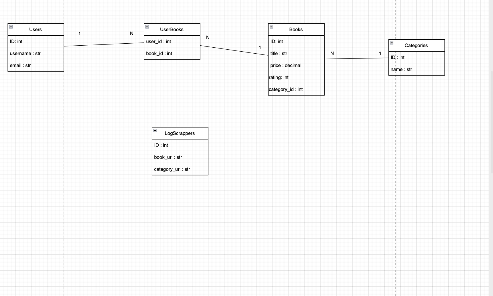

# Book Inventory

A Python project that scrapes a site about books , transforms it and loads it into a database.

## Table of Contents
- [Structure](#structure)
- [Installation](#installation)
- [Usage](#usage)
- [Features](#features)
- [Contributing](#contributing)
- [License](#license)

## Structure

### Tree Schema

```plain text
book_inventory/
│
├── scraper/
│   ├── __init__.py
│   ├── scraper.py
│   ├── parser.py
│   └── categories.py
│
├── database/
│   ├── __init__.py
│   ├── db.py
│   ├── models.py
│   └── queries.py
│
├── services/
│   ├── __init__.py
│   ├── book_service.py
│   ├── user_service.py
│   └── scrape_service.py
│
├── cli/
│   ├── __init__.py
│   └── menu.py
│
├── utils/
│   ├── __init__.py
│   └── helpers.py
│
├── main.py
├── requirements.txt
└── README.md
```

### ER Model


## Installation
Install [Python](https://www.python.org/downloads/) IDLE.  

Now we create a virtual environment so we can run the code.  

### 1. Creating the environment:
```bash
python -m venv venv
```
### 2. Activating the environment:
#### For Mac/Linux:

```bash
source venv/bin/activate
```
#### For Windows:
```bash
.\venv\Scripts\activate
```
### 3. Installing all the necessary libraries to run the project:
```bash
pip install -r requirements.txt
```

## Usage
### 1. Make the main file executable
```bash
chmod u+x main.py
```

### 2. Run the project
```bash
./main.py
```
or 
```bash
python3 main.py
```
## Features

## Contributing
1. Fork the repo
2. Create a feature branch (`git checkout -b feature-name`)
3. Commit your changes (`git commit -m "Add feature"`)
4. Push to the branch (`git push origin feature-name`)
5. Open a Pull Request

## License
This project is licensed under the MIT License.
